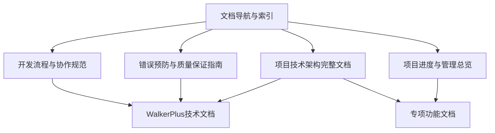

# JapanGuide项目文档导航与索引

**文档版本**: v2.0  

**项目状态**: 核心功能完成，生产就绪  

---

## 📚 文档结构总览

### 🏗️ 核心技术文档
```
技术架构与实现:
├── 项目技术架构完整文档.md        # 📘 技术架构、数据存储、核心实现
├── 错误预防与质量保证指南.md      # 🚨 错误预防、质量检查、测试策略
└── 开发流程与协作规范.md          # 🔧 开发规范、AI协作、代码标准
```

### 📊 项目管理文档
```
项目管理与进度:
├── 项目进度与管理总览.md          # 📈 进度追踪、商业化路线、风险管理
├── WalkerPlus页面生成器技术修复总结.md  # 🛠️ 具体技术修复记录
└── 图片管理功能技术文档.md        # 🖼️ 图片搜索、上传、管理功能
```

### 🗂️ 专项功能文档
```
专项技术实现:
├── WalkerPlus三重爬取功能技术实现.md    # 🕷️ 数据爬取技术
├── WalkerPlus页面生成器统一化完成报告.md  # ✅ 统一化项目总结
└── 各种历史技术记录文档              # 📋 历史开发记录
```

---

## 🎯 文档使用指南

### 👥 按角色查阅

#### 🧑‍💻 开发人员
**必读文档**：
1. [项目技术架构完整文档](./项目技术架构完整文档.md) - 了解整体架构
2. [错误预防与质量保证指南](./错误预防与质量保证指南.md) - 避免常见错误
3. [开发流程与协作规范](./开发流程与协作规范.md) - 开发规范和流程

**参考文档**：
- WalkerPlus相关技术文档 - 具体功能实现参考

#### 🏢 项目管理人员
**必读文档**：
1. [项目进度与管理总览](./项目进度与管理总览.md) - 项目整体状况
2. [项目技术架构完整文档](./项目技术架构完整文档.md) - 技术决策背景

#### 🔧 运维人员
**必读文档**：
1. [错误预防与质量保证指南](./错误预防与质量保证指南.md) - 监控和错误处理
2. [项目技术架构完整文档](./项目技术架构完整文档.md) - 部署和架构信息

### 🎪 按任务类型查阅

#### 🆕 新功能开发
```
开发流程:
1. 架构设计 → 项目技术架构完整文档.md
2. 错误预防 → 错误预防与质量保证指南.md  
3. 开发规范 → 开发流程与协作规范.md
4. 进度跟踪 → 项目进度与管理总览.md
```

#### 🐛 问题修复
```
修复流程:
1. 错误分析 → 错误预防与质量保证指南.md
2. 历史问题 → WalkerPlus页面生成器技术修复总结.md
3. 架构理解 → 项目技术架构完整文档.md
4. 测试验证 → 错误预防与质量保证指南.md
```

#### 📈 项目评估
```
评估维度:
1. 技术状况 → 项目技术架构完整文档.md
2. 项目进度 → 项目进度与管理总览.md
3. 质量状况 → 错误预防与质量保证指南.md
4. 商业价值 → 项目进度与管理总览.md
```

---

## 📖 核心文档内容简介

### 📘 项目技术架构完整文档
**内容概要**：
- 🏗️ **架构设计**: 四层页面架构、混合存储策略
- 💾 **数据管理**: JSON文件存储 vs 数据库使用
- 🔧 **技术实现**: 页面生成器、重复检测、覆盖功能
- 🚀 **部署运维**: 性能监控、部署配置

**适用场景**：
- 新团队成员技术onboarding
- 架构决策制定和评估
- 技术债务分析和重构
- 系统集成和接口设计

### 🚨 错误预防与质量保证指南
**内容概要**：
- 🎯 **核心原则**: 数据库分离、路径命名、JSON结构
- 🚨 **错误模式**: 5大类常见错误及预防措施
- 📋 **检查清单**: 开发、测试、代码审查标准
- 🧪 **测试策略**: 单元测试、集成测试、E2E测试
- 📊 **监控告警**: 性能监控、错误监控、业务监控

**适用场景**：
- 日常开发错误预防
- 代码审查和质量控制
- 问题排查和根因分析
- 测试策略制定和执行

### 🔧 开发流程与协作规范
**内容概要**：
- 👥 **AI协作模式**: 协作流程、角色分工、沟通规范
- 📝 **代码规范**: TypeScript规范、React组件规范
- 🔄 **开发流程**: Git工作流、发布流程、版本管理
- 🛠️ **工具配置**: 开发环境、调试工具、自动化工具

**适用场景**：
- 团队协作规范建立
- 开发环境配置和维护
- 代码质量标准制定
- 项目流程优化改进

### 📈 项目进度与管理总览
**内容概要**：
- 🎯 **项目概况**: 基本信息、创始人背景、项目目标
- 📊 **进度追踪**: 里程碑进度、当前工作重点
- 🚀 **商业化路线**: 三阶段发展计划、收入模式设计
- 🔧 **技术债务**: 已解决问题、当前债务、解决计划
- 📋 **协作管理**: AI协作模式、风险管理、行动计划

**适用场景**：
- 项目整体状况评估
- 商业决策制定支持
- 投资者沟通汇报
- 团队目标对齐统一

---

## 🗃️ 历史文档归档

### 已合并的重复文档
以下文档已合并到新的统一文档中，保留作为历史参考：

#### 技术架构类 (已合并到: 项目技术架构完整文档.md)
- ~~0627-技术架构详细文档.md~~ 
- ~~0628-技术架构优化与错误预防指南.md~~

#### 项目进度类 (已合并到: 项目进度与管理总览.md)  
- ~~0627-项目进度跟踪文档.md~~
- ~~0628-项目进度与问题总结.md~~
- ~~0628-项目进度与里程碑记录.md~~
- ~~0627-项目综合状态文档.md~~

#### 错误预防类 (已合并到: 错误预防与质量保证指南.md)
- ~~0628-错误修复与预防方法.md~~

#### 文档索引类 (已合并到: 文档导航与索引.md)
- ~~0627-文档整合索引.md~~

### 保留的专项文档
以下文档包含特定功能的详细实现，保留独立状态：

- ✅ **0628-WalkerPlus页面生成器技术修复总结.md** - 具体修复记录
- ✅ **0628-图片管理功能技术文档.md** - 图片功能详细实现
- ✅ **0628-WalkerPlus三重爬取功能技术实现.md** - 爬取功能实现
- ✅ **0628-WalkerPlus页面生成器统一化完成报告.md** - 统一化项目总结

---

## 🔍 文档搜索与查找

### 按关键词快速定位

#### 🏗️ 架构相关
- **数据存储**: 项目技术架构完整文档.md → 数据架构章节
- **页面结构**: 项目技术架构完整文档.md → 页面架构设计章节  
- **API设计**: 项目技术架构完整文档.md → 核心技术实现章节

#### 🚨 错误处理
- **常见错误**: 错误预防与质量保证指南.md → 常见错误模式章节
- **调试方法**: 错误预防与质量保证指南.md → 测试策略章节
- **监控告警**: 错误预防与质量保证指南.md → 监控与告警章节

#### 📊 项目管理
- **进度状况**: 项目进度与管理总览.md → 里程碑进度追踪章节
- **商业计划**: 项目进度与管理总览.md → 商业化路线图章节
- **风险管理**: 项目进度与管理总览.md → 风险管理章节

#### 🛠️ 具体功能
- **WalkerPlus**: WalkerPlus相关专项文档
- **图片管理**: 图片管理功能技术文档.md
- **数据爬取**: WalkerPlus三重爬取功能技术实现.md

### 🔗 文档间关联关系



---

## 📝 文档维护规范

### 更新频率
- **核心文档**: 每月审查更新
- **项目进度**: 每周更新状态  
- **专项文档**: 功能变更时更新
- **索引文档**: 新增文档时更新

### 版本管理
- 使用Git跟踪所有文档变更
- 重要变更记录在文档头部
- 保持向后兼容的链接引用

### 质量标准
- 文档结构清晰，层次分明
- 代码示例完整可执行
- 链接引用准确有效
- 中文表达规范准确

---

## 📞 文档使用支持

### 获取帮助
- **技术问题**: 查阅错误预防与质量保证指南
- **架构疑问**: 参考项目技术架构完整文档
- **流程规范**: 查看开发流程与协作规范
- **项目状况**: 查阅项目进度与管理总览

### 反馈建设
- 发现文档问题及时反馈
- 建议改进内容和结构
- 分享使用经验和最佳实践

---

**文档维护**: 定期更新内容，确保信息准确性  
**访问权限**: 项目团队成员均可访问  
**技术支持**: AI协作系统提供实时技术支持 